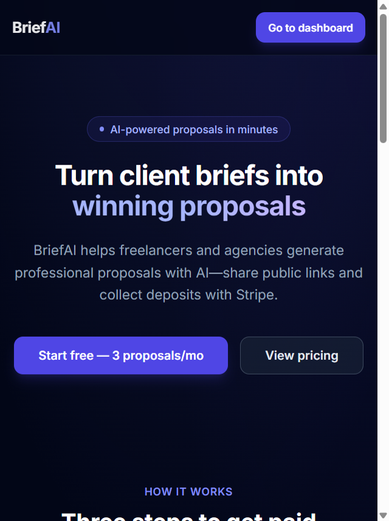
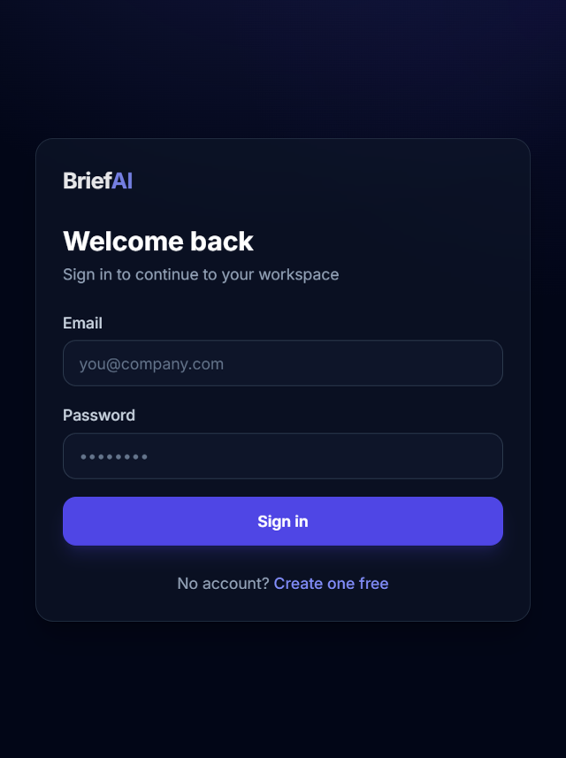
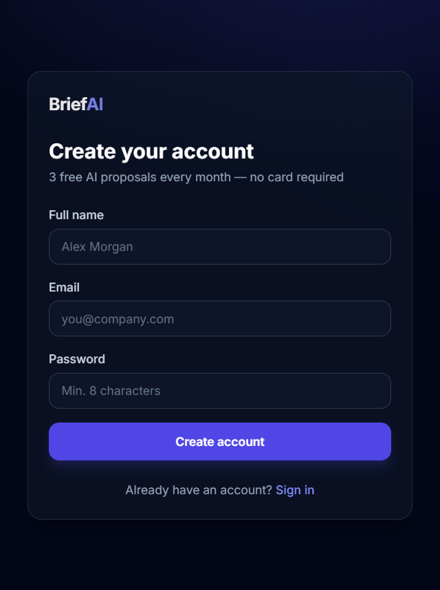
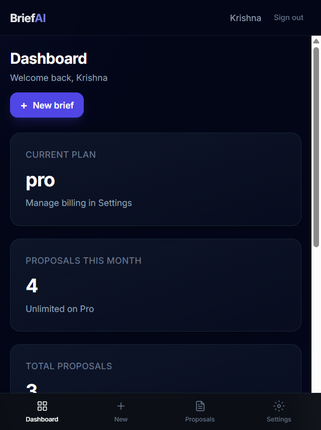
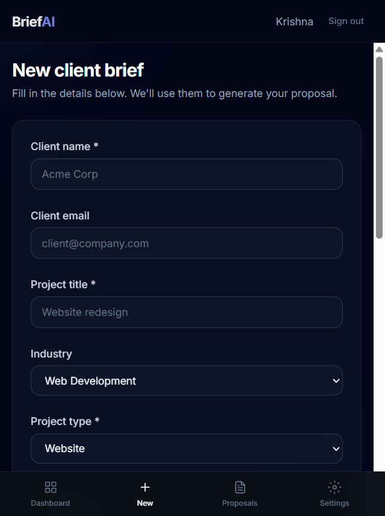
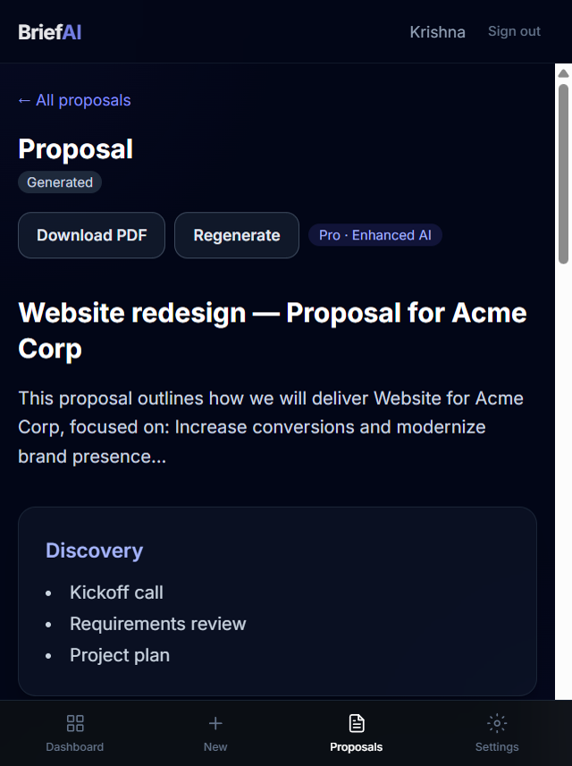
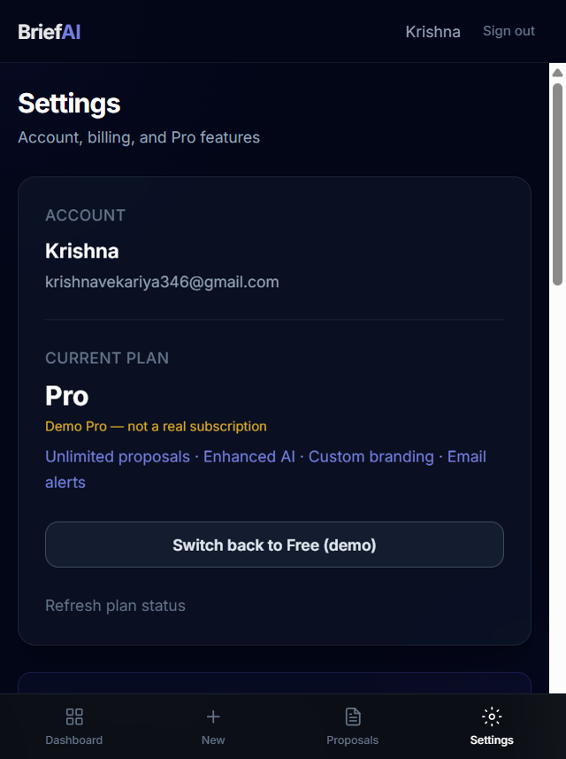
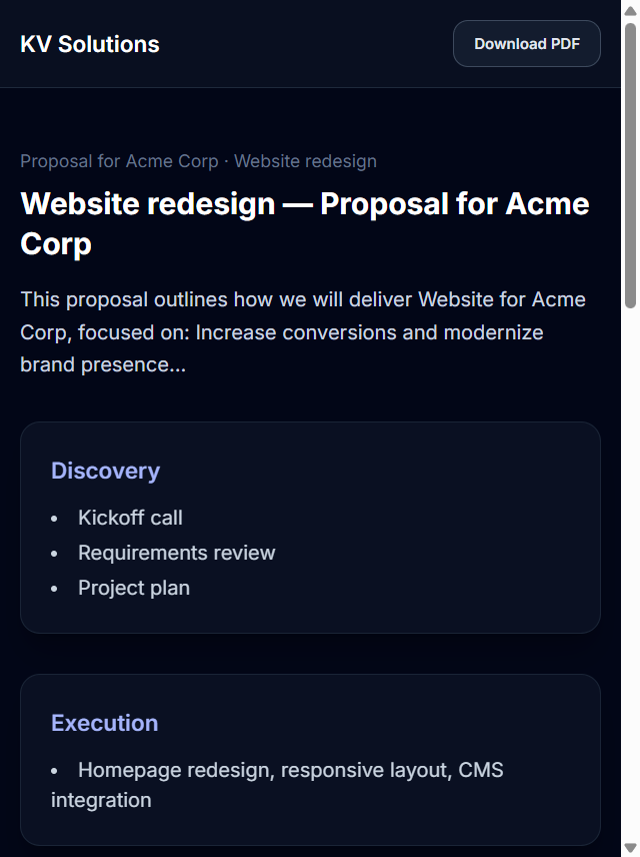

# BriefAI — AI Proposal SaaS (Full-Stack)


---

## 📌 About The Project

**BriefAI** is a full-stack SaaS web application that helps freelancers and agencies turn client briefs into professional AI-generated proposals—with scope, timeline, pricing, and a shareable public link for clients.

This project demonstrates:

- Full-stack **TypeScript** (React + Express)
- **REST API** design with JWT authentication
- **MongoDB** data modeling (users, briefs, proposals)
- **AI integration** (Google Gemini, Groq, or mock mode)
- **Freemium SaaS** (Free vs Pro plans, usage limits)
- **Stripe-ready** billing (Checkout, webhooks, payment links)
- **Transactional email** (Brevo SMTP / dev preview)
- Responsive dashboard UI with **React Hook Form** + **Yup** validation

---

## 🌐 Live Demo

> Add your deployed URL after hosting (see [DEPLOY.md](./DEPLOY.md)).

[Open Live App](https://your-briefai-app.vercel.app)


| Service  | URL                                |
| -------- | ---------------------------------- |
| Frontend | `https://your-frontend.vercel.app` |
| API      | `https://your-api.onrender.com`    |


---

## 🚀 Key Features

- 🔐 **Authentication** — Register, login, logout with JWT-secured API
- 📝 **Client briefs** — Structured brief form with validation (goals, budget, timeline, deliverables)
- 🤖 **AI proposals** — Generate & regenerate proposals (Gemini, Groq, or mock)
- 📊 **Dashboard** — Overview of briefs and proposals
- 📄 **Proposal workspace** — View, edit, download PDF, publish
- 🔗 **Public client links** — Share proposals at `/p/:slug`
- 💎 **Free vs Pro** — Monthly quota on Free; unlimited + extras on Pro
- 🎨 **Pro branding** — Custom logo & company name on public pages
- 💳 **Stripe billing** — Checkout, Customer Portal, webhooks (test/live keys)
- 🧪 **Demo billing** — Activate Pro locally without Stripe (`BILLING_MODE=demo`)
- 📧 **Email notifications** — Welcome, publish, client delivery, payment alerts (Pro)
- 📱 **Responsive UI** — Sidebar + mobile bottom navigation
- 🔒 **Protected routes** — Auth-gated app pages

---

## 🛠 Built With

### Frontend (`client/`)

- React.js 18
- TypeScript
- Vite
- React Router
- Tailwind CSS
- React Hook Form + Yup
- Axios

### Backend (`server/`)

- Node.js + Express
- TypeScript
- MongoDB + Mongoose
- JWT + bcrypt
- Zod
- Stripe
- Nodemailer
- Google Gemini API / Groq API

---

## 💎 Free vs Pro


| Feature                        | Free     | Pro       |
| ------------------------------ | -------- | --------- |
| AI proposals / month           | 3        | Unlimited |
| Public proposal links          | ✅        | ✅         |
| AI detail level                | Standard | Enhanced  |
| Custom branding                | ❌        | ✅         |
| Stripe payment link on publish | ❌        | ✅         |
| Email notifications            | ❌        | ✅         |


---

## 📁 Project Structure

```
briefai/
├── client/                         # React frontend (Vite + TypeScript)
│   ├── public/
│   ├── src/
│   │   ├── components/
│   │   │   ├── brief/              # Brief form
│   │   │   ├── layout/             # App shell, sidebar, mobile nav
│   │   │   ├── proposal/         # Proposal preview
│   │   │   ├── settings/         # Branding, plan comparison
│   │   │   └── ui/                 # Logo, FormField, dialogs
│   │   ├── context/                # Auth context
│   │   ├── hooks/                  # useProposals, etc.
│   │   ├── lib/
│   │   │   ├── api.ts              # Axios client
│   │   │   └── validation/         # Yup schemas
│   │   └── pages/                  # Landing, Dashboard, Briefs, Settings…
│   ├── .env.example
│   └── package.json
│
├── server/                         # Express API (TypeScript)
│   ├── src/
│   │   ├── config/                 # DB, Stripe
│   │   ├── middleware/             # Auth, errors
│   │   ├── models/                 # User, Brief, Proposal, WebhookEvent
│   │   ├── routes/                 # auth, briefs, proposals, billing, webhooks
│   │   ├── services/               # AI, email, billing, usage, timeline
│   │   ├── utils/                  # JWT helpers
│   │   └── index.ts
│   ├── .env.example
│   └── package.json
│
├── screenshots/                    # Add app screenshots here
├── FREE_AI_SETUP.md
├── DEPLOY.md
├── render.yaml
└── README.md
```

---

## ⚙️ Getting Started

### Prerequisites

- Node.js 18+
- npm
- MongoDB (local or [MongoDB Atlas](https://www.mongodb.com/cloud/atlas))
- (Optional) [Gemini](https://aistudio.google.com/apikey) or [Groq](https://console.groq.com/keys) API key — see [FREE_AI_SETUP.md](./FREE_AI_SETUP.md)
- (Optional) Stripe test keys — or use **demo billing** (no Stripe needed)
- (Optional) [Brevo](https://www.brevo.com) SMTP for real emails

---

### Installation

**1. Clone the repository**

```
git clone https://github.com/krishnavekariya346-blip/briefai.git
```

**2. Navigate to project folder**

```
cd briefai
```

**3. Install dependencies (server + client)**

```
cd server
npm install

cd ../client
npm install
```

**4. Configure environment**

```
cd ../server
copy .env.example .env
```

Edit `server/.env`:

- `MONGODB_URI` — MongoDB connection string
- `JWT_SECRET` — long random secret
- `CLIENT_URL` — `http://localhost:5173`
- `AI_PROVIDER` — `mock` | `gemini` | `groq`
- `BILLING_MODE=demo` — for portfolio demos (no Stripe)

Optional client env:

```
cd ../client
copy .env.example .env
```

**5. Run the project (two terminals)**

Terminal 1 — API:

```
cd server
npm run dev
```

API: `http://localhost:5000`

Terminal 2 — Frontend:

```
cd client
npm run dev
```

App: `http://localhost:5173`

---

## 💻 Usage

BriefAI workflow:

1. **Register / Login** on the landing page
2. **Create a brief** — client details, goals, budget, timeline
3. **Generate proposal** — AI builds scope, timeline, and pricing
4. **Review & edit** — refine content, download PDF
5. **Settings** — activate **Pro (demo)** or Stripe upgrade; set branding (Pro)
6. **Publish** — get a public link to send to your client

### App modules


| Module          | Description                              |
| --------------- | ---------------------------------------- |
| Landing         | Marketing page, pricing, CTA             |
| Dashboard       | Stats and quick actions                  |
| Briefs          | Create & manage client briefs            |
| Proposals       | List, detail, generate, publish          |
| Settings        | Plan, billing, Pro branding              |
| Public proposal | Client-facing proposal page (`/p/:slug`) |


---

## 🔧 Environment Variables

### Server (`server/.env`)


| Variable                | Required  | Description                 |
| ----------------------- | --------- | --------------------------- |
| `MONGODB_URI`           | ✅         | MongoDB connection string   |
| `JWT_SECRET`            | ✅         | JWT signing secret          |
| `CLIENT_URL`            | ✅         | Frontend URL (CORS & links) |
| `AI_PROVIDER`           | —         | `mock`                      |
| `GEMINI_API_KEY`        | If gemini | Google AI Studio key        |
| `GROQ_API_KEY`          | If groq   | Groq console key            |
| `BILLING_MODE`          | —         | `demo`                      |
| `STRIPE_SECRET_KEY`     | If stripe | Stripe test/live secret     |
| `STRIPE_PRICE_ID_PRO`   | If stripe | Pro subscription price ID   |
| `STRIPE_WEBHOOK_SECRET` | If stripe | Webhook signing secret      |
| `FREE_PROPOSAL_LIMIT`   | —         | Free tier cap (default `3`) |
| `SMTP_`* / `EMAIL_`*    | For email | Brevo SMTP settings         |


### Client (`client/.env`)


| Variable       | Description                                    |
| -------------- | ---------------------------------------------- |
| `VITE_API_URL` | API base (default `http://localhost:5000/api`) |


> ⚠️ Never commit `server/.env` or `client/.env` — only `.env.example` files.

---

## 💳 Billing Modes


| Mode       | Description                                      |
| ---------- | ------------------------------------------------ |
| `demo`     | Instant Pro in Settings — no Stripe account      |
| `stripe`   | Real Checkout (test card: `4242 4242 4242 4242`) |
| `disabled` | No upgrade path                                  |


---

## 📧 Email (Pro)

Pro users can receive:

- Welcome email on upgrade
- Publish confirmation
- Proposal sent to client (if client email on brief)
- Payment received (with Stripe)

**Production:** configure Brevo SMTP in `server/.env`  
**Development:** leave SMTP empty → Ethereal preview links in API terminal

---

## 📜 Available Scripts


| Folder    | Command           | Description              |
| --------- | ----------------- | ------------------------ |
| `server/` | `npm run dev`     | API with hot reload      |
| `server/` | `npm run build`   | Compile TypeScript       |
| `server/` | `npm start`       | Run production build     |
| `client/` | `npm run dev`     | Vite dev server          |
| `client/` | `npm run build`   | Production build         |
| `client/` | `npm run preview` | Preview production build |


---

## 🚀 Deployment

See **[DEPLOY.md](./DEPLOY.md)** for MongoDB Atlas, Render (API), Vercel (frontend), and Stripe webhooks.

---

## 📸 Screenshots

### 🏠 Landing


### 🔐 Login


### 📝 Register


### 📊 Dashboard


### 📋 New Brief


### 🤖 Proposal Detail


### ⚙️ Settings


### 🔗 Public Proposal (Client View)


---

## 📬 Contact

**Krishna Vekariya**

GitHub:  
[https://github.com/krishnavekariya346-blip](https://github.com/krishnavekariya346-blip)

---

## 🙏 Acknowledgments

- [Google Gemini API](https://aistudio.google.com/) / [Groq](https://groq.com/)
- [Stripe](https://stripe.com/docs) — payments & subscriptions
- [Brevo](https://www.brevo.com/) — transactional email
- [MongoDB Atlas](https://www.mongodb.com/cloud/atlas)
- [React](https://react.dev/) · [Vite](https://vitejs.dev/) · [Express](https://expressjs.com/) · [Mongoose](https://mongoosejs.com/)

---

## 📄 License

Portfolio & educational use. Add MIT or your preferred license when open-sourcing.
